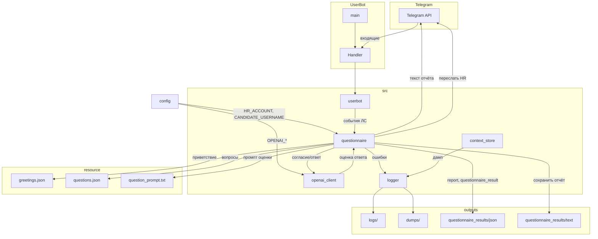

# Telegram UserBot с OpenAI

## Архитектура




## Структура проекта

```
UserBot/
├── resource/
│   ├── json/
│   │   ├── greetings.json       # приветствия для первого сообщения
│   │   └── questions.json       # вопросы опросника по ключу "question"
│   └── prompts/
│       └── question_prompt.txt # промпт для оценки ответа LLM
├── src/
│   ├── __init__.py
│   ├── openai_client.py        # запросы к OpenAI (диалог, оценка ответа)
│   ├── context_store.py         # хранение 10 пар для чата
│   ├── logger.py                # логгер: ошибки в logs/, дамп в dumps/
│   ├── questionnaire.py         # опросник: состояние, report, red_flags, результат
│   └── userbot.py               # Telethon-клиент, обработчик, запуск опросника
├── logs/                        # логи ошибок (errors.log)
├── dumps/                       # дампы контекста (context_*.json)
├── questionnaire_results/
│   ├── json/                    # дампы questionnaire_result (JSON)
│   └── text/                    # текстовые отчёты (username_YYYY_MM_DD-HH_MM.txt)
├── config.py                    # переменные окружения
├── config.example.py
├── main.py                      # точка входа
├── requirements.txt
└── README.md
```

Используемый код: [UserBot/util/userbot.py](UserBot/util/userbot.py), [UserBot/util/config.py](UserBot/util/config.py).

## 1. Конфигурация

В `config.example.py` и `config.py` добавить:

```python
OPENAI_API_KEY = "sk-..."  # из platform.openai.com
OPENAI_MODEL = "gpt-4o-mini"  # или gpt-4o
```

## 2. Модуль `src/context_store.py`

- **Ключ контекста**: `user_id` (int) — в ЛС один собеседник.
- **Структура пары**: `{"user": str, "assistant": str, "datetime": datetime}` — сообщение пользователя, ответ бота, время.
- **Хранилище**: `dict[int, deque]` — `{user_id: deque([pair1, ..., pair10])}`, максимум 10 пар, при добавлении новой — выталкивать старую.
- **Методы**:
  - `add_exchange(user_id, user_msg, assistant_msg)` — добавить пару.
  - `get_messages_for_openai(user_id) -> list[dict]` — возврат в формате `[{"role": "user", "content": "..."}, {"role": "assistant", "content": "..."}, ...]` для последних 10 пар.

## 3. Модуль `src/openai_client.py`

- Синхронный клиент `openai.OpenAI(api_key=...)`.
- Функция `get_reply(messages: list[dict], system_prompt: str = "") -> str`:
  - Формирует `messages` с optional system prompt.
  - Вызов `client.chat.completions.create(model=..., messages=messages)`.
  - Возврат `response.choices[0].message.content`.

## 4. Модуль `src/userbot.py`

- Импорт `from telethon.sync import TelegramClient`.
- События: `events.NewMessage(incoming=True, func=lambda e: e.is_private)` — только входящие ЛС.
- В обработчике (async):
  1. Взять `event.sender_id`, `event.text`.
  2. Игнорировать сообщения без текста (медиа).
  3. `context_store.get_messages_for_openai(sender_id)` + добавить текущее сообщение.
  4. `openai_client.get_reply(messages)`.
  5. `await event.reply(reply_text)`.
  6. `context_store.add_exchange(sender_id, event.text, reply_text)`.
- Обработка `SessionPasswordNeededError`, `FloodWaitError` — как в [userbot_DS.py](UserBot/util/userbot_DS.py).

## 5. Точка входа `main.py`

```python
from src.userbot import run_userbot
if __name__ == "__main__":
    run_userbot()
```

## 6. Зависимости

Добавить в `requirements.txt`:

```
telethon>=1.34.0
openai>=1.0.0
```

## 7. Модуль `src/logger.py`

- **Логирование ошибок**: FileHandler → `logs/errors.log`, уровень ERROR.
- **Дамп контекста**: каждые 10 пар сообщений (глобальный счётчик) — сериализация всего хранилища в JSON в `dumps/context_YYYYMMDD_HHMMSS.json`. datetime в ISO-формате.
- **API**: `setup()` — настроить и вернуть логгер; `on_exchange_added(store)` — вызывать из `context_store.add_exchange`; `dump_context(store)` — сохранить store в файл.
- Директории `logs/` и `dumps/` создаются при первом обращении, добавлены в `.gitignore`.

## Важные детали

- Обработчики событий Telethon — `async def`, вызовы к OpenAI — синхронные; выполнять через `asyncio.to_thread(openai_client.get_reply, ...)` или вынести в sync-обёртку, чтобы не блокировать event loop.
- Поля `username`, `phone_number` из ТЗ — сохраняем в паре для возможного логирования/отладки, но ключ контекста только `user_id`.

---

## Опросник (модификация)

### Конфигурация опросника

Переменные окружения (добавить в [config.py](config.py) и [config.example.py](config.example.py)):

- **HR_ACCOUNT** (str) — идентификатор аккаунта HR (username или user_id), в ЛС которого пересылается отчёт.
- **CANDIDATE_USERNAME** (str) — идентификатор кандидата, которому бот пишет первым; пока что единственный (например, `@username` или username без @).

### Логика опросника

- Бот при старте (или по таймеру/команде) **пишет первым** пользователю из списка кандидатов (пока только `CANDIDATE_USERNAME`).
- Приветствие выбирается случайно из `resource/json/greetings.json`.
- Ведётся счётчик **red_flags: int = 0** на сессию опроса.
- Согласие/отказ: ответ пользователя анализируется через OpenAI (утвердительно/положительно → переход к вопросам; отрицательно → вежливое прощание).
- Вопросы из `resource/json/questions.json` по ключу `"question"` во вложенных словарях.
- Каждый ответ пользователя отправляется в LLM вместе со словарём вопроса; промпт — [resource/prompts/question_prompt.txt](resource/prompts/question_prompt.txt). Ответ LLM парсится в словарь и добавляется в структуру отчёта (`report`). Если `profanity_detected is true`: увеличить `red_flags`; при `red_flags == 1` — вежливо попросить повторить; при `red_flags > 1` — вежливо свернуть беседу.
- По завершении (все вопросы или досрочный выход) формируется **questionnaire_result** (user — telegram-username, date — ISO UTC+3, questions, profanity_detected), дамп в `questionnaire_results/json/`. Если свёрнуто из-за грубости — `profanity_detected: true`.
- Текст отчёта формируется из questionnaire_result; при `profanity_detected == true` указать причину раннего завершения. Переслать в ЛС на **HR_ACCOUNT**. Сохранить сообщение в `questionnaire_results/text/` в файле `username_YYYY_MM_DD-HH_MM.txt`.

Модули опросника размещать в `src/`. Логирование — через существующий модуль в `src/logger.py`, логи в `logs/`.

