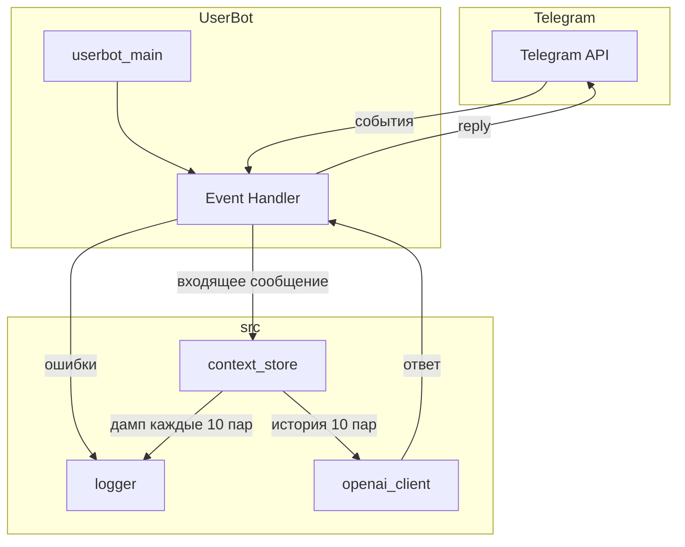

# Telegram UserBot с OpenAI

## Архитектура




## Структура проекта

```
UserBot/
├── src/
│   ├── __init__.py
│   ├── openai_client.py    # запросы к OpenAI, получение ответа
│   ├── context_store.py    # хранение 10 пар {user_msg, bot_msg, datetime}
│   ├── logger.py           # логгер: ошибки, дамп контекста
│   └── userbot.py          # Telethon-клиент, обработчик событий
├── logs/                   # логи ошибок (errors.log)
├── dumps/                  # дампы контекста (context_YYYYMMDD_HHMMSS.json)
├── config.py               # переменные окружения
├── config.example.py
├── main.py                 # точка входа
├── requirements.txt
└── README.md
```

Используемый код: [UserBot/util/userbot.py](UserBot/util/userbot.py), [UserBot/util/config.py](UserBot/util/config.py).

## 1. Конфигурация

В `config.example.py` и `config.py` добавить:

```python
OPENAI_API_KEY = "sk-..."  # из platform.openai.com
OPENAI_MODEL = "gpt-4o-mini"  # или gpt-4o
```

## 2. Модуль `src/context_store.py`

- **Ключ контекста**: `user_id` (int) — в ЛС один собеседник.
- **Структура пары**: `{"user": str, "assistant": str, "datetime": datetime}` — сообщение пользователя, ответ бота, время.
- **Хранилище**: `dict[int, deque]` — `{user_id: deque([pair1, ..., pair10])}`, максимум 10 пар, при добавлении новой — выталкивать старую.
- **Методы**:
  - `add_exchange(user_id, user_msg, assistant_msg)` — добавить пару.
  - `get_messages_for_openai(user_id) -> list[dict]` — возврат в формате `[{"role": "user", "content": "..."}, {"role": "assistant", "content": "..."}, ...]` для последних 10 пар.

## 3. Модуль `src/openai_client.py`

- Синхронный клиент `openai.OpenAI(api_key=...)`.
- Функция `get_reply(messages: list[dict], system_prompt: str = "") -> str`:
  - Формирует `messages` с optional system prompt.
  - Вызов `client.chat.completions.create(model=..., messages=messages)`.
  - Возврат `response.choices[0].message.content`.

## 4. Модуль `src/userbot.py`

- Импорт `from telethon.sync import TelegramClient`.
- События: `events.NewMessage(incoming=True, func=lambda e: e.is_private)` — только входящие ЛС.
- В обработчике (async):
  1. Взять `event.sender_id`, `event.text`.
  2. Игнорировать сообщения без текста (медиа).
  3. `context_store.get_messages_for_openai(sender_id)` + добавить текущее сообщение.
  4. `openai_client.get_reply(messages)`.
  5. `await event.reply(reply_text)`.
  6. `context_store.add_exchange(sender_id, event.text, reply_text)`.
- Обработка `SessionPasswordNeededError`, `FloodWaitError` — как в [userbot_DS.py](UserBot/util/userbot_DS.py).

## 5. Точка входа `main.py`

```python
from src.userbot import run_userbot
if __name__ == "__main__":
    run_userbot()
```

## 6. Зависимости

Добавить в `requirements.txt`:

```
telethon>=1.34.0
openai>=1.0.0
```

## 7. Модуль `src/logger.py`

- **Логирование ошибок**: FileHandler → `logs/errors.log`, уровень ERROR.
- **Дамп контекста**: каждые 10 пар сообщений (глобальный счётчик) — сериализация всего хранилища в JSON в `dumps/context_YYYYMMDD_HHMMSS.json`. datetime в ISO-формате.
- **API**: `setup()` — настроить и вернуть логгер; `on_exchange_added(store)` — вызывать из `context_store.add_exchange`; `dump_context(store)` — сохранить store в файл.
- Директории `logs/` и `dumps/` создаются при первом обращении, добавлены в `.gitignore`.

## Важные детали

- Обработчики событий Telethon — `async def`, вызовы к OpenAI — синхронные; выполнять через `asyncio.to_thread(openai_client.get_reply, ...)` или вынести в sync-обёртку, чтобы не блокировать event loop.
- Поля `username`, `phone_number` из ТЗ — сохраняем в паре для возможного логирования/отладки, но ключ контекста только `user_id`.

